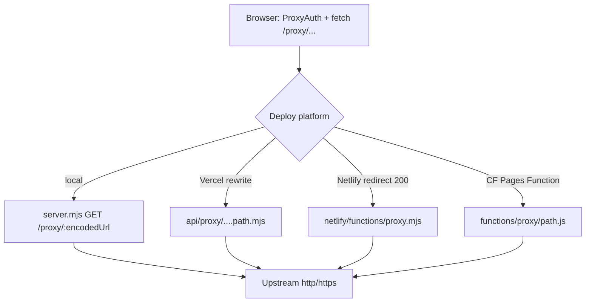

## 0. 术语

- **同源代理路径**：浏览器可见的 `/proxy/{encodeURIComponent(绝对URL)}`，与 `js/config.js` 的 `PROXY_URL` 一致
- **平台内部入口**：rewrite 后的真实函数路径（如 Vercel `/api/proxy/*`、Netlify `/.netlify/functions/proxy/:splat`）；前端不感知
- **M3U8 改写**：把播放列表内相对/绝对媒体 URI 再包一层 `/proxy/...`，使分片也走同源代理
- **主列表 / 媒体列表**：含 `#EXT-X-STREAM-INF` 的 master；含分片 URL 的 media playlist
- **透传流**：不解析 body，把上游字节流 pipe 给客户端（本地 Express）

（PASSWORD 哈希、代理鉴权定义见 [system-overview](system-overview.md) 第 0 节。）

## 1. 定位与受众

- **哪一块**：出站网关子系统（搜索 API JSON、m3u8、分片、部分媒体）
- **谁读**：改代理安全策略 / 排「某平台能播某平台不能」/ design 对接代理契约
- **读完能**：分清四实现能力差、改一处是否要同步、从哪几个文件下手

## 2. 结构与交互

### 2.1 为什么四份实现而不是一份

前端契约刻意固定为 **`/proxy/` + auth 查询参数**（`js/config.js:2` · `js/proxy-auth.js:60-74`）。各托管平台的函数模型、路径捕获、哈希 API 不同，因此用 **四套适配器** 实现同一对外契约，而不是在浏览器里分平台分支。

### 2.2 路由接入（对外仍是 /proxy）

| 平台 | 对外路径 | 接入方式 | 实现文件 |
|---|---|---|---|
| 本地 Express | `/proxy/:encodedUrl` | 路由直接注册 | `server.mjs:155-232` |
| Vercel | `/proxy/:path*` → `/api/proxy/:path*` | `vercel.json` rewrite | `vercel.json:2-6` · `api/proxy/[...path].mjs:339+` |
| Netlify | `/proxy/*` → `/.netlify/functions/proxy/:splat` | `netlify.toml` 200 重写 | `netlify.toml:15-18` · `netlify/functions/proxy.mjs:190+` |
| Cloudflare Pages | `/proxy/*` | Pages Function 路径约定 | `functions/proxy/[[path]].js:27+` |

路径解码：把 `/proxy/` 后的一段（可能被平台拆成数组）`decodeURIComponent` 成目标绝对 URL（Vercel：`api/proxy/[...path].mjs:55-78,374-411`；Netlify：`proxy.mjs:43-54,231-248`；CF：`[[path]].js:138-164`；Express：`server.mjs:165-166`）。

### 2.3 共用处理流水线（概念）

1. **鉴权** `auth` / `t`
2. **解析目标 URL**（必须像 `http(s)://...`）
3. **出站 fetch**（UA / Accept / Referer）
4. **分支**：
   - **Express**：始终 stream 透传 + 头过滤
   - **Vercel / Netlify / CF**：若判定 M3U8 → 改写后返回文本；否则返回内容（CF 对二进制走 ArrayBuffer）

### 2.4 能力对照（现状差，不是规划）

| 能力 | Express | Vercel | Netlify | Cloudflare |
|---|---|---|---|---|
| 鉴权 auth + t(60min) | 有 `server.mjs:121-152` | 有 `...path.mjs:306-336` | 有 `proxy.mjs:93-124` | 有 `[[path]].js:76-116`（subtle） |
| 无 PASSWORD 则拒代理 | 是 | 是 | 是 | 是 |
| 显式 SSRF 黑名单（本机/私网） | 有 `isValidUrl` `server.mjs:97-118` | **无**（仅 URL 形态） | **无** | **无** |
| M3U8 改写 + master 选最高 BANDWIDTH | **无**（纯透传） | 有 | 有 | 有 |
| 出站形态 | axios **stream** + 可选重试 | node-fetch **text** | node-fetch **text** | fetch text **或** ArrayBuffer |
| 二进制媒体友好 | 流式天然支持 | 全文 `text()` 后 send，大文件/二进制不适合 | 同 Vercel | `isBinaryContent` 分支 `[[path]].js:249-304` |
| 缓存头 | 静态 `CACHE_MAX_AGE`；代理跟上游头 | `CACHE_TTL` 默认 86400 | 同 | 同 |
| 递归上限 master | n/a | `MAX_RECURSION` 默认 5 | 同 | 同 |
| 广告过滤 | 无 | `FILTER_DISCONTINUITY=false` | 同 | 注释：交给播放器 |

**为何对照重要**：同一前端在「本地 Express」与「Vercel」上对 **嵌套 m3u8** 行为会不同——本地不改写列表内 URI，播放器可能直连外链或再自管代理；Serverless 三件套会把分片 URI 写成 `/proxy/...`。

### 2.5 M3U8 改写（Vercel / Netlify / CF 同源逻辑）

1. `isM3u8Content`：Content-Type 含 mpegurl **或** body 以 `#EXTM3U` 开头（`api/proxy/[...path].mjs:182-187`）
2. 若含 `#EXT-X-STREAM-INF` / `#EXT-X-MEDIA:` → master：选 **最大 BANDWIDTH** 变体，递归拉取子列表（深度 ≤ `MAX_RECURSION`）（`...path.mjs:233-301`）
3. media：非 `#` 行与 KEY/MAP 的 URI → `resolveUrl` → `rewriteUrlToProxy` → `/proxy/${encodeURIComponent(abs)}`（`...path.mjs:128-133,205-230`）
4. **不**在代理做广告 discontinuity 过滤（`...path.mjs:38-39`）

Netlify / CF 同结构函数名一致（`netlify/functions/proxy.mjs:153-186` · `functions/proxy/[[path]].js:313-406`）。

### 2.6 鉴权契约（跨平台一致）

| 项 | 约定 | 锚点 |
|---|---|---|
| 客户端加签 | `auth=<passwordSha256>&t=<Date.now()>` | `js/proxy-auth.js:60-74` |
| 服务端比对 | `SHA256(env.PASSWORD) === auth` | Express/Vercel/Netlify 用 `crypto.createHash`；CF 用 `crypto.subtle` |
| 时间窗 | 若带 `t`，超过约 60 分钟失败 | 各 `validateAuth*` |
| 缺 PASSWORD | 直接 401 / false | 四处实现均拒绝 |

密码 **HTML 注入**（把 `{{PASSWORD}}` 换成哈希）不在本代理文件内，但同属边缘安全面：`server.mjs:55-63` · `middleware.js` · `netlify/edge-functions/inject-env.js` · `functions/_middleware.js`。

## 3. 数据与状态

| 状态 | 归属 | 说明 |
|---|---|---|
| 目标 URL | 请求路径瞬时 | 不落库 |
| auth / t | 查询参数 | 客户端每次（或缓存 hash）附带 |
| `proxyAuthHash` | 浏览器 localStorage | 客户端缓存，非服务端会话（`js/proxy-auth.js:17-21`） |
| 上游响应 | 内存/流 | Express 不缓冲完整 body；Vercel/Netlify 对文本全量读入；CF 二进制 ArrayBuffer |
| `CACHE_TTL` | 响应头 | Serverless 三件套写 `Cache-Control: public, max-age=...` |
| 业务会话表 | **无** | 代理无用户表 |

## 4. 关键决策

无已落档 ADR/compound decision。观察项（非拍板）：

- 四实现代码大量复制（尤其 Vercel ≈ Netlify），后续是否抽取共享模块属规划，归 roadmap/decide，不写入「现状必达」
- Express 有 SSRF 黑名单、Serverless 三件套目前主要靠「必须是 http(s) URL」——安全基线不一致，修之前先当**已知不对称**

`TODO: SSRF 策略是否四端对齐、M3U8 是否也应在 Express 改写 — 有共识后 cs-decide`

## 5. 代码锚点

| 文件 | 说明 |
|---|---|
| `js/config.js:2` | `PROXY_URL` |
| `js/proxy-auth.js` | 客户端加签与缓存 |
| `server.mjs:97-232` | 本地鉴权、SSRF、流式代理 |
| `vercel.json:2-6` | Vercel `/proxy` rewrite |
| `api/proxy/[...path].mjs` | Vercel 全逻辑（鉴权、M3U8、handler） |
| `netlify.toml:15-18` | Netlify `/proxy` 200 重写 |
| `netlify/functions/proxy.mjs` | Netlify 全逻辑 |
| `functions/proxy/[[path]].js` | CF 鉴权、二进制分支、M3U8 |
| `.env.example:18-20` | `BLOCKED_*` / `FILTERED_HEADERS`（主要服务 Express） |

## 6. 已知约束 / 边界情况

- **未设 PASSWORD**：所有代理实现拒绝出站（防开放代理）
- **Express 独有 SSRF 列表**：`BLOCKED_HOSTS` / `BLOCKED_IP_PREFIXES`（`.env.example:18-19` · `server.mjs:102-113`）；部署在 Vercel/Netlify/CF 时**不要假设**同等拦截已生效
- **Express 不做 M3U8 改写**：本地调试嵌套 playlist 行为可能与线上不一致
- **Vercel/Netlify 用 `response.text()`**：大二进制/图片经代理可能损坏或内存暴涨；CF 用扩展名/MIME 走二进制分支（`[[path]].js:249-304`）——与近期「图片等二进制无法显示」类修复方向一致
- **Master 只追最高带宽一条**：不向客户端暴露多码率选择（`processMasterPlaylist`）
- **递归上限**：默认 5；超限抛错（`MAX_RECURSION`）
- **CF 文件内鉴权调用两次**：入口 `onRequest` 先 `await validateAuth`（`[[path]].js:32`），函数体内又有同步风格 `if (!validateAuth(...))`（`[[path]].js:119-129`，且未 await）——属实现气味，issue 时优先核对，本 doc 只记录现象
- **CORS**：Serverless 实现普遍 `Access-Control-Allow-Origin: *` 并处理 OPTIONS

## 7. 相关文档

- 依赖：[system-overview](system-overview.md)（全系统位置与主链路）
- 可后续：`player-pipeline`（播放器如何再消费改写后的 m3u8 / 广告过滤）
- 需求/ADR：无
