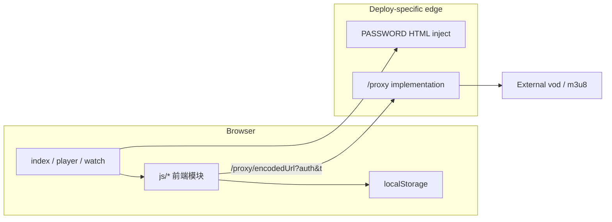

## 0. 术语

- **同源代理（/proxy）**：浏览器只请求本站 `/proxy/{encodeURIComponent(目标URL)}`，由平台函数/Express 出站拉取；统一前缀来自 `js/config.js` 的 `PROXY_URL`
- **PASSWORD 哈希**：服务端用明文 `PASSWORD` 算 SHA-256，注入页面 `window.__ENV__.PASSWORD`；浏览器永不持有明文环境变量
- **代理鉴权**：代理查询参数 `auth`（密码哈希）+ `t`（时间戳）；与页面登录态同源但用途是防未授权滥用代理
- **采集源（API site）**：外部 vod 接口；内置表在 `customer_site.js` 合并进 `API_SITES`，自定义源由用户本地配置

## 1. 定位与受众

- **哪一块**：整仓运行时结构（不是某一 feature 方案）
- **谁读**：feature-design 对接边界、issue-analyze 定模块、新人上手
- **读完能**：知道请求怎么走、密码/代理为何必须、改代码从哪几个入口下手

## 2. 结构与交互

### 2.1 为什么这样分

LibreTV 要同时跑在 **本地 Express / Vercel / Netlify / Cloudflare Pages**。业务 UI 与搜索逻辑尽量纯前端；平台差异收口在两处：

1. **HTML 密码注入**（把 `{{PASSWORD}}` 换成哈希）
2. **`/proxy/*` 出站实现**（鉴权、SSRF 防护、流式转发）

前端始终打 `PROXY_URL = '/proxy/'`，靠各平台 rewrite 接到对应函数，避免前端分叉。

### 2.2 模块划分与依赖方向

依赖方向：**页面 → 前端模块 → 同源代理 → 外网**；代理与注入层不依赖前端模块实现细节。

| 层 | 职责 | 代表路径 |
|---|---|---|
| 页面壳 | 路由入口、脚本加载、`__ENV__` 占位 | `index.html` / `player.html` / `watch.html` |
| 前端配置与源 | 常量、`API_SITES` 扩展 | `js/config.js` · `js/customer_site.js` |
| 搜索 / API 客户端 | 拼外链、走代理、内存缓存 | `js/search.js` · `js/api.js` |
| 播放 | HLS/广告过滤/连播等 | `js/player.js` · `player.html` |
| 观看跳转 | 参数与 returnUrl 桥接 | `js/watch.js` · `watch.html` |
| UI / 编排 | 首页交互与面板 | `js/app.js` · `js/ui.js` · `js/index-page.js` |
| 密码门禁 | 校验哈希、TTL 本地态 | `js/password.js` |
| 代理鉴权客户端 | 给代理 URL 加 `auth`/`t` | `js/proxy-auth.js` |
| 本地服务 | 静态 + 注入 + `/proxy` | `server.mjs` |
| Vercel | 中间件注入 + serverless 代理 | `middleware.js` · `api/proxy/[...path].mjs` · `vercel.json` |
| Netlify | edge 注入 + functions 代理 | `netlify/edge-functions/inject-env.js` · `netlify/functions/proxy.mjs` · `netlify.toml` |
| Cloudflare Pages | `_middleware` 注入 + Pages Function 代理 | `functions/_middleware.js` · `functions/proxy/[[path]].js` |

### 2.3 主链路（搜索 → 播放）

1. 用户打开 `index.html`；注入层写入 `window.__ENV__.PASSWORD`（`server.mjs:55-63` / `middleware.js:28-38` / `functions/_middleware.js:11-18`）
2. `password.js` 要求有效部署密码；验证通过写入 `localStorage`（`js/password.js:46-60`）
3. 搜索：`search.js` / `api.js` 拼采集 URL，经 `ProxyAuth.addAuthToProxyUrl` 请求 `/proxy/...`（`js/search.js:29-37` · `js/api.js:71-76`）
4. 平台代理校验 `auth`/`t`，校验目标 URL，再出站拉取（`server.mjs:121-153,155-213`）
5. 选片后经 `watch.html` 把 query + `returnUrl` 交给 `player.html`（`js/watch.js:1-93`）
6. 播放器再经同一 `/proxy` 拉 m3u8/分片；广告过滤在播放器侧（代理注释：广告不在代理处理，`api/proxy/[...path].mjs:38-39`）

### 2.4 跨模块契约

| 契约 | 约定 | 锚点 |
|---|---|---|
| 代理路径 | 前端固定 `PROXY_URL = '/proxy/'` + `encodeURIComponent(绝对URL)` | `js/config.js:2` |
| 代理鉴权 | `auth=<sha256>` 与服务端密码哈希一致；`t` 约 60 分钟 | `js/proxy-auth.js:60-74` · `server.mjs:121-152` |
| 密码注入占位 | HTML 中 `window.__ENV__.PASSWORD = "{{PASSWORD}}"` 被替换为 64 位 hex 或空 | `middleware.js:35-37` · `functions/_middleware.js:17-18` |
| 采集 API 形态 | 搜索 `?ac=videolist&wd=`，详情 `?ac=videolist&ids=` | `js/config.js:47-65` |
| 平台路由 | Vercel/Netlify 把 `/proxy/*` rewrite 到函数，对外仍是 `/proxy` | `vercel.json:2-6` · `netlify.toml:15-18` |

## 3. 数据与状态

| 状态 | 位置 | 所有权 | 说明 |
|---|---|---|---|
| `window.__ENV__.PASSWORD` | 页面运行时 | 服务端注入，前端只读 | 哈希，非明文 |
| 密码已验证 | `localStorage`（`PASSWORD_CONFIG.localStorageKey`） | `password.js` 写 | 含 timestamp / passwordHash，TTL 约 90 天（`js/config.js:8-10` · `js/password.js:55-59`） |
| 代理鉴权缓存 | `localStorage.proxyAuthHash` + 内存 | `proxy-auth.js` | `js/proxy-auth.js:17-21,109-112` |
| 搜索历史等 | `localStorage`（如 `videoSearchHistory`） | 前端 UI | `js/config.js:3-4` |
| API 响应缓存 | 进程内 `Map`（`apiCache`） | `api.js` | 5 分钟、最多约 100 条（`js/api.js:1-30`） |
| 返回页 / 搜索来源 | `localStorage` + URL query | `watch.js` / player | `js/watch.js:66-73` |
| 业务数据库 | **无** | — | 无用户账号服务端存储 |

持久化边界：**服务端无业务库**；可持久状态几乎全在浏览器 `localStorage`。代理侧可有平台缓存（如 CF/Vercel 实现里的 `CACHE_TTL`），不改变「无业务 DB」结论。

## 4. 关键决策

当前 `.codestable/compound/` 与 `requirements/adrs/` 为空，无已落档 decision 可引用。

观察（非决策正文）：多份代理实现并存，是为多平台部署而非领域分层——细节若需固化，应用 `cs-decide` / `cs-keep` 另记。

`TODO: 多代理实现是否 dedupe、PASSWORD 强制策略，若团队有共识应沉淀为 decision`

## 5. 代码锚点

| 入口 | 说明 |
|---|---|
| `server.mjs:66-84` · `155-232` · `248-259` | 本地页渲染、`/proxy`、监听端口 |
| `middleware.js:4-50` | Vercel HTML 密码注入与 matcher |
| `api/proxy/[...path].mjs:1-80` | Vercel 代理入口与目标 URL 解析 |
| `netlify.toml:9-18` · `netlify/functions/proxy.mjs` | Netlify 路由与代理函数 |
| `functions/_middleware.js` · `functions/proxy/[[path]].js:27-47` | Cloudflare 注入与代理鉴权入口 |
| `js/config.js` | `PROXY_URL` / `API_CONFIG` / 密码与播放常量 |
| `js/customer_site.js:46-50` | 合并采集源到 `API_SITES` |
| `js/password.js:7-37,46-80` | 是否受保护、强制门禁、校验与本地态 |
| `js/proxy-auth.js:60-127` | 代理 URL 加签与 `window.ProxyAuth` |
| `js/search.js:1-37` | 单源搜索经代理 |
| `js/api.js:34-76` | `/api/search` 形态处理与代理 fetch |
| `js/watch.js` | 到 player 的参数桥 |
| `js/player.js` | 播放器主逻辑（大文件，行为细节可另 backfill） |
| `js/app.js` · `js/ui.js` | 首页编排与 UI |
| `vercel.json` · `netlify.toml` · `Dockerfile` · `render.yaml` | 部署映射 |

## 6. 已知约束 / 边界情况

- **必须配置 `PASSWORD`**：未配置时前端视作需要强制设密；本地代理在密码为空时直接拒绝代理（`server.mjs:127-130` · `js/password.js:20-21` · README 声明）
- **代理 SSRF 基线**：仅 `http/https`；默认拦本机与私网前缀（`server.mjs:97-118` · `.env.example:18-19`）
- **代理鉴权时间窗**：带 `t` 时约 60 分钟（`server.mjs:142-149` · `js/proxy-auth.js:94-100`）
- **前端不直连采集站**：注释写明请求经内部代理（`js/config.js:101`）
- **广告过滤在播放器**：代理侧默认不做分片广告过滤（`api/proxy/[...path].mjs:38-39`）
- **`API_SITES` 本体可为空**：靠 `extendAPISites` 合并；先加载 `config.js` 再加载 `customer_site.js`（`js/customer_site.js:46-50`）
- **敏感信息**：`.env` 含本地密钥，勿提交；架构描述不引用具体密钥值

## 7. 相关文档

- 索引：`.codestable/ARCHITECTURE.md`
- 已有专项：[frontend-app](frontend-app.md)（首页 SPA）、[proxy-gateway](proxy-gateway.md)（四平台代理差异）、[player-pipeline](player-pipeline.md)（播放与广告过滤）
- 需求 / ADR：尚未建立（`cs-req` / `cs-domain`）
